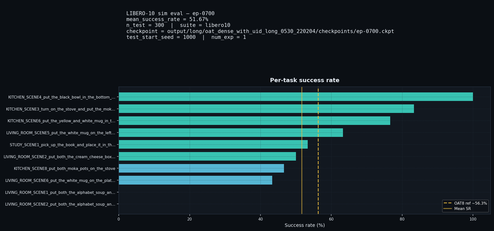
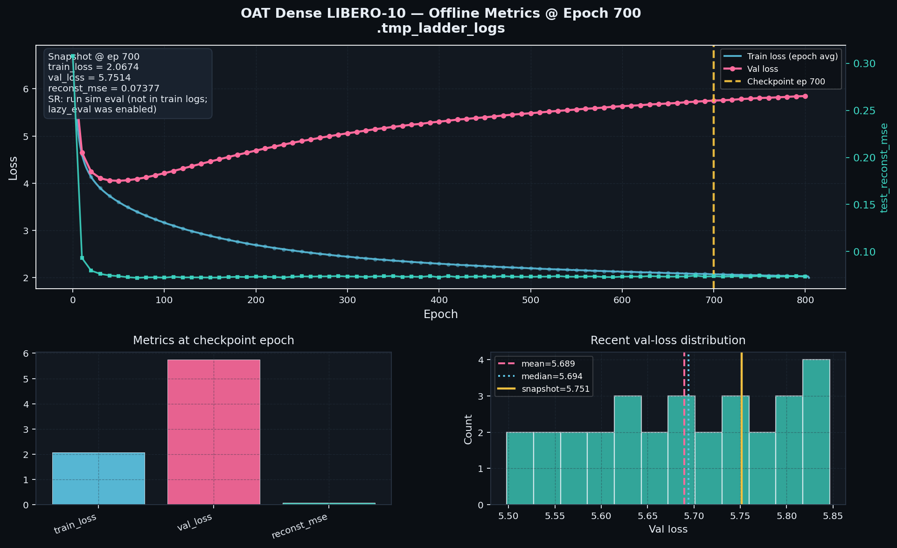
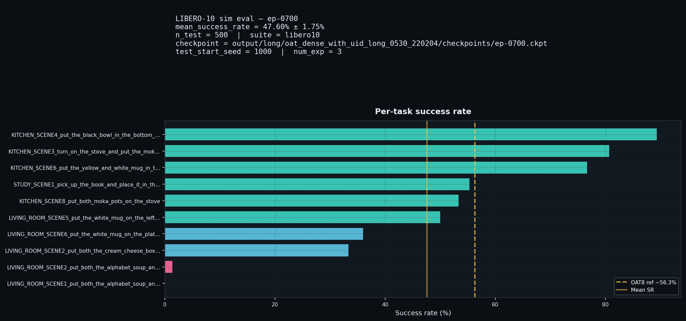
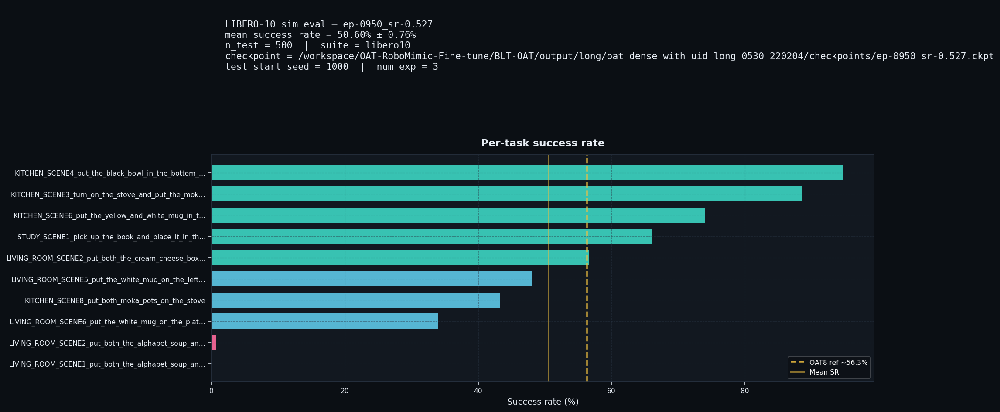
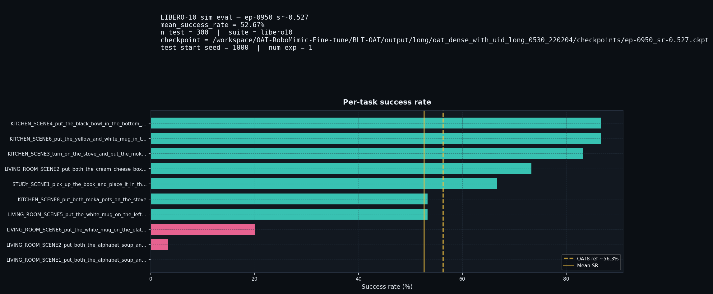
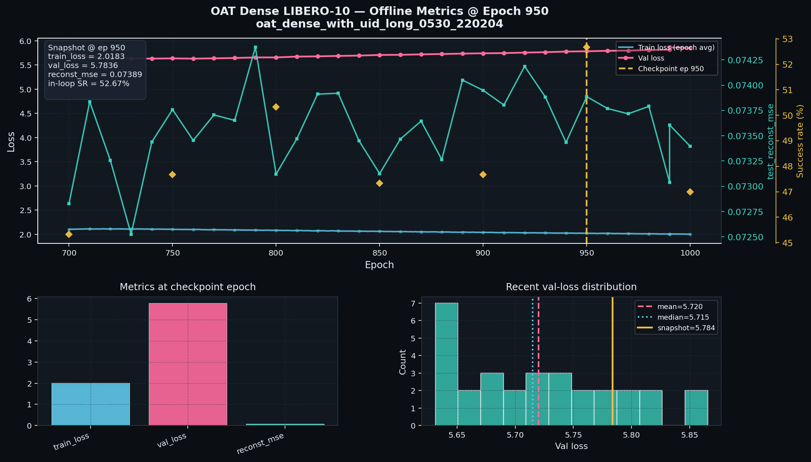

# OAT-BLT-Dense

**Dense visual memory for [Ordered Action Tokenization (OAT)](https://arxiv.org/abs/2602.04215) on LIBERO-10**

Fork of the official OAT codebase extended with spatial patch memory, cross-attention conditioning, and a full LIBERO-10 training / evaluation pipeline (checkpoint ladder, HF publishing, counterfactual overfit monitoring).

| | |
|---|---|
| **Benchmark** | LIBERO-10, N=500 demos |
| **Primary run** | `oat_dense_with_uid_long_0530_220204` |
| **Selection metric** | `mean_success_rate` (sim rollout), not `val_loss` |
| **Paper reference** | OAT-8 on LIBERO-10: **56.3% ± ~1.0** ([Liu et al., 2026](https://arxiv.org/abs/2602.04215)) |

### Branches

| Branch | Contents |
|--------|----------|
| **`BLT-OAT-dense`** (default) | Dense visual memory, training ladder, confirm eval, HF dashboards |
| **`Blockwise-OAT`** | Parallel tail decoder (AR prefix + blockwise inference) |

Cluster scripts and eval do **not** depend on branch names — they use the checked-out tree under `BLT-OAT/` on the host.

---

## Motivation

> *"OAT tokenizes continuous actions into ordered discrete tokens with prefix-decodability: any prefix of the token sequence decodes to a valid action."*  
> — Liu, Han, Gao, Zhao, Chen & Du, [arXiv:2602.04215](https://arxiv.org/abs/2602.04215)

Standard OAT policies compress each RGB frame into a **single pooled vector** before cross-attention. We keep the **decoder and action tokenizer unchanged** and only replace the memory tensor with **dense spatial tokens** (ResNet feature maps + 1×1 projection), optional state memory tokens, and task-UID embeddings.

> *Offline loss and reconstruction MSE need not track closed-loop success rate; rollout SR is the decision metric.*  
> — project protocol (see [experiment log](docs/experiment_log_dense_visual_memory.md))

---

## Architecture

```
RGB (agentview, wrist)  →  DenseRgbEncoder  →  patch tokens × cameras × time
state (+ task_uid)      →  state_to_memory  →  state memory tokens
                              ↓
              AutoregressiveModel (cross-attn decoder, frozen OATTok)
                              ↓
                    8 action tokens  →  OATTok.detokenize  →  action chunk
```

| Module | Default OAT | OAT-BLT-Dense |
|--------|-------------|---------------|
| Visual encoding | Global pool / SpatialSoftmax | Patch tokens (`DenseRgbEncoder`) |
| Memory length | ≈ `n_obs_steps` (2) | ≈ 2×cameras×To×L_patch + state |
| Action tokenizer | FSQ + frozen | **unchanged** |
| AR decoder blocks | cross-attn | **unchanged** (extended `memory_pos_emb`) |

Key flags: `policy.use_dense_visual_memory`, `policy.use_state_memory_tokens`, `policy.use_task_uid_in_state_tokens`, `policy.embed_dim=256`.

Implementation: [`oat/policy/oatpolicy.py`](oat/policy/oatpolicy.py), [`oat/perception/robomimic_vision_encoder.py`](oat/perception/robomimic_vision_encoder.py), [`oat/model/autoregressive/transformer_cache.py`](oat/model/autoregressive/transformer_cache.py).

---

## Research timeline

| Date | Stage | Outcome |
|------|--------|---------|
| 2026-05-30 | Short A/B (`libero10_N32`, 1k steps) | `task_uid` in state tokens hurts MSE; dense+state without uid ≈ legacy |
| 2026-05-30 | Long-run N500 (`dense + state + task_uid`) | Primary run `oat_dense_with_uid_long_0530_220204` |
| 2026-05-31 | HF checkpoint watcher | Snapshots at epochs 300 / 500 / 700 → Hugging Face |
| 2026-05-31 | Counterfactual overfit watcher | Hourly reports, **no training stop** ([report](docs/results/overfit_watcher/early_stop_report.md)) |
| 2026-06-01 | Phase A ladder SR (30 ep/task) | Screen ep-0300 / 0500 / 0700 |
| 2026-06-01 | Phase B confirm (50 ep/task × 3 seeds) | **ep-0700: 47.60% ± 1.75%** → resume decision |
| 2026-06-08 | Resume ep-0700 → 1000, in-loop eval every 50 ep | In-loop best **52.67% @ ep-950** (300 ep, single seed block) |
| 2026-06-13 | Phase B confirm ep-0950 (50 ep/task × 3 seeds) | **ep-0950: 50.60% ± 0.76%** (cluster confirm eval done) |

Full chronological notes: [`docs/experiment_log_dense_visual_memory.md`](docs/experiment_log_dense_visual_memory.md).

### Monitoring during training

1. **HF upload watcher** — [`scripts/watch_hf_checkpoint_upload.py`](scripts/watch_hf_checkpoint_upload.py): when `epoch > {300,500,700}`, copies `ep-XXXX.ckpt` to the matching HF repo; training continues.
2. **Overfit watcher** — [`scripts/watch_early_stop_report.py`](scripts/watch_early_stop_report.py): counterfactual early-stop / plateau signals only; writes `early_stop_report.md` to the run dir (mirrored on [HF ep-700](https://huggingface.co/hackhackhack66666/OAT-BLT-Libero-700/tree/main/overfit_watcher)).
3. **Short in-loop eval** — `lazy_eval=false`, `rollout_every=200` (long run) or `50` (resume); `n_test=300` ≈ 30 episodes per task.

---

## Results

### Phase A — checkpoint ladder (screen, 30 ep/task, 1 seed block)

| Checkpoint | Mean SR | HF eval artifacts |
|------------|--------:|-------------------|
| [ep-0300](https://huggingface.co/hackhackhack66666/OAT-BLT-LIBERO-300) | **39.67%** | [dashboard](docs/results/ladder_300/sim_eval_dashboard.png) · [eval_log](docs/results/ladder_300/eval_log.json) |
| [ep-0500](https://huggingface.co/hackhackhack66666/OAT-BLT-LIBERO-500) | **38.00%** | [dashboard](docs/results/ladder_500/sim_eval_dashboard.png) · [eval_log](docs/results/ladder_500/eval_log.json) |
| [ep-0700](https://huggingface.co/hackhackhack66666/OAT-BLT-Libero-700) | **51.67%** | [dashboard](docs/results/ladder_700/sim_eval_dashboard.png) · [eval_log](docs/results/ladder_700/eval_log.json) |

**Decision:** resume from **ep-0700** (best ladder screen).

<p align="center">
  
  
</p>

### Phase B — confirm eval (50 ep/task, 3 seed blocks)

| Checkpoint | Mean SR | 95% CI (across seeds) | Artifacts |
|------------|--------:|----------------------|-----------|
| ep-0700 | **47.60%** | ± 1.75% | [dashboard](docs/results/phase_b_confirm/phase_b_confirm_ep-0700_dashboard.png) · [eval_log](docs/results/phase_b_confirm/eval_log.json) |
| **ep-0950** | **50.60%** | ± 0.76% | [dashboard](docs/results/phase_b_confirm/phase_b_confirm_ep-0950_dashboard.png) · [eval_log](docs/results/phase_b_confirm_ep0950/eval_log.json) · [summary](docs/results/phase_b_confirm/eval_summary_ep-0950.md) |

**Protocol:** `scripts/cluster/run_confirm_ep0950_eval.sh` — seeds 1000 / 1500 / 2000 (`seed_stride=500`), `n_parallel_envs=4`, checkpoint `ep-0950_sr-0.527.ckpt`. Completed **2026-06-13** on cluster (`oat_confirm_ep0950`).

Per-seed SR (ep-0950): **52.0%** · **49.4%** · **50.4%**.

<p align="center">
  
  
</p>

Artifacts: [`docs/results/phase_b_confirm/`](docs/results/phase_b_confirm/) · [`docs/results/phase_b_confirm_ep0950/`](docs/results/phase_b_confirm_ep0950/) · [HF ep-0700 `sim_eval_phase_b/`](https://huggingface.co/hackhackhack66666/OAT-BLT-Libero-700/tree/main/sim_eval_phase_b) · [HF ep-0950](https://huggingface.co/hackhackhack66666/oat-dense-blt-950/tree/main/sim_eval_phase_b)

### Resume training (ep-0700 → 1000, in-loop SR every 50 epochs)

| Epoch | In-loop mean SR (300 ep) |
|------:|-------------------------:|
| 700 | 45.33% |
| 800 | 50.33% |
| **950** | **52.67%** (best top-k) |
| 1000 | 47.00% |

Best checkpoint on cluster: `ep-0950_sr-0.527.ckpt`. In-loop SR is noisier than Phase B (30 vs 50 ep/task, 1 vs 3 seeds); treat Phase B as the calibrated reference.

**Best checkpoint dashboards** (same style as ep-0700 ladder):

| | |
|---|---|
| Sim eval (30 ep/task) | [dashboard](docs/results/ladder_950/sim_eval_dashboard.png) · [eval_log](docs/results/ladder_950/eval_log.json) |
| Training metrics @ ep 950 | [dashboard](docs/results/ladder_950/training_metrics_dashboard.png) |

<p align="center">
  
  
</p>

Regenerate: `python scripts/make_checkpoint_dashboards.py --run-dir output/long/oat_dense_with_uid_long_0530_220204 --epoch 950 --tag ep-0950_sr-0.527 --out docs/results/ladder_950`

---

## Hugging Face checkpoints

| Epoch | Model repo | Contents |
|------:|------------|----------|
| 300 | [OAT-BLT-LIBERO-300](https://huggingface.co/hackhackhack66666/OAT-BLT-LIBERO-300) | `ep-0300.ckpt`, training dashboard, Phase A `sim_eval/` |
| 500 | [OAT-BLT-LIBERO-500](https://huggingface.co/hackhackhack66666/OAT-BLT-LIBERO-500) | `ep-0500.ckpt`, training dashboard, Phase A `sim_eval/` |
| 700 | [OAT-BLT-Libero-700](https://huggingface.co/hackhackhack66666/OAT-BLT-Libero-700) | `ep-0700.ckpt`, training logs, overfit watcher, Phase A + **Phase B** eval |
| **950** | [**oat-dense-blt-950**](https://huggingface.co/hackhackhack66666/oat-dense-blt-950) | `ep-0950.ckpt`, training logs, Phase A + **Phase B** confirm eval |

Download:

```bash
huggingface-cli download hackhackhack66666/OAT-BLT-Libero-700 ep-0700.ckpt \
  --local-dir output/long/oat_dense_with_uid_long_0530_220204/checkpoints
```

Tokenizer (unchanged from OAT): `tokenizer_ep-0950_mse-0.002.ckpt` (Mirageinv/oat on cluster).

---

## Quick start

Based on upstream OAT; clone with submodules:

```bash
git clone --recurse-submodules git@github.com:GadzhiAskhabaliev/OAT-BLT-Dense.git
cd OAT-BLT-Dense
uv sync && uv pip install -e .
```

Dataset: [chaoqi-liu/libero10_N500.zarr](https://huggingface.co/datasets/chaoqi-liu/libero10_N500.zarr) or build locally (see original [OAT README](https://github.com/Chaoqi-LIU/oat)).

### Train dense policy

```bash
HYDRA_FULL_ERROR=1 MUJOCO_GL=egl uv run accelerate launch \
  scripts/run_workspace.py --config-name=train_oatpolicy \
  task/policy=libero/libero10 \
  policy.use_dense_visual_memory=true \
  policy.use_state_memory_tokens=true \
  policy.use_task_uid_in_state_tokens=true \
  policy.embed_dim=256 \
  policy.dense_feature_dim=256 \
  task.policy.lazy_eval=false \
  policy.action_tokenizer.checkpoint=path/to/tokenizer.ckpt
```

### Evaluate

```bash
# Phase B protocol
uv run scripts/eval_policy_sim.py \
  -c path/to/ep-0700.ckpt \
  -o output/eval/confirm \
  -d cuda:0 -n 3 \
  --n-test-per-task 50 \
  --test-start-seed 1000 \
  --n-parallel-envs 4 \
  --mp-context spawn
```

### Ladder & HF publish (cluster)

```bash
export HF_TOKEN=hf_...
PHASE=A bash scripts/cluster/run_ladder_sr_eval.sh
BEST=ep-0700 PHASE=B bash scripts/cluster/run_ladder_sr_eval.sh
bash scripts/cluster/launch_hf_upload_tmux.sh
```

Resume after Phase B: [`scripts/cluster/run_resume_train_sim_eval.sh`](scripts/cluster/run_resume_train_sim_eval.sh) · plan: [`docs/plans/libero_sr_eval_ladder_300_500_700.md`](docs/plans/libero_sr_eval_ladder_300_500_700.md)

### Analysis scripts

```bash
python scripts/summarize_training_runs.py --root output/long
python scripts/plot_training_runs.py output/long/oat_dense_with_uid_long_0530_220204
python scripts/publish_ladder_eval_to_hf.py --help
```

Bundled result mirrors: [`docs/results/`](docs/results/).

---

## Repository layout

```
oat/                    # policy, perception, env, tokenizer
scripts/
  cluster/              # tmux launchers, ladder eval, HF upload, resume train
  eval_policy_sim.py    # standalone LIBERO eval
  watch_*_report.py     # HF upload & overfit watchers
docs/
  experiment_log_*.md   # full research journal (RU)
  plans/                # eval protocol & architecture plan
  results/              # HF dashboards & eval_log mirrors (this repo)
```

---

## Краткое резюме (RU)

**Задача:** расширить OAT пространственной visual memory на LIBERO-10 без изменения декодера и токенизатора действий.

**Протокол:** короткие smoke-абляции → long-run N500 → лестница чекпоинтов 300/500/700 → confirm eval → resume с периодическим sim-SR. Метрика отбора — `mean_success_rate`, не `val_loss`.

**Итог лестницы:** ep-0700 лучший на screen (51.67%) и confirm (47.60% ± 1.75%); после resume in-loop пик 52.67% (ep-950). **Phase B confirm ep-0950: 50.60% ± 0.76%** (+3 pp vs ep-0700 confirm). Сравнение с 56.3% OAT-8 — с оговоркой по протоколу eval.

---

## Citation

OAT (base method):

```bibtex
@misc{liu2026oatorderedactiontokenization,
  title={OAT: Ordered Action Tokenization},
  author={Chaoqi Liu and Xiaoshen Han and Jiawei Gao and Yue Zhao and Haonan Chen and Yilun Du},
  year={2026},
  eprint={2602.04215},
  archivePrefix={arXiv},
  primaryClass={cs.RO},
  url={https://arxiv.org/abs/2602.04215},
}
```

## License

MIT — see [LICENSE](LICENSE). Upstream OAT: [Chaoqi-LIU/oat](https://github.com/Chaoqi-LIU/oat).
