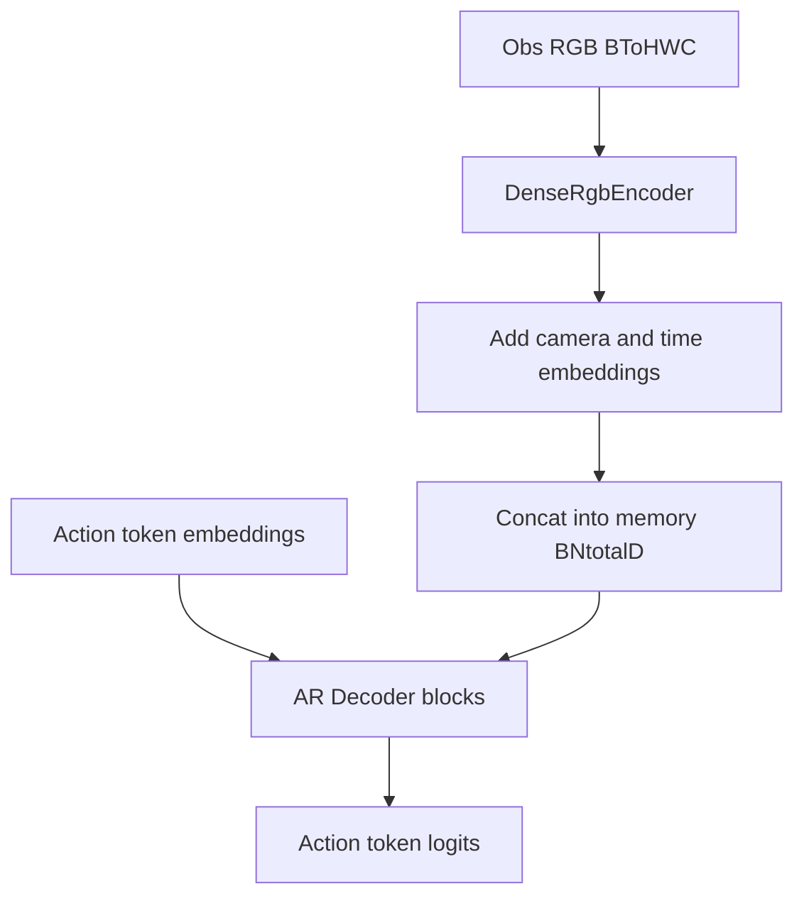

# План dense visual memory для OAT-BLT-Dense (LIBERO)

## Контекст и ключевое решение
Целевой кодбейс: этот репозиторий (OAT-BLT-Dense). Пайплайн уже ориентирован на LIBERO (см. [`oat/config/train_oatpolicy.yaml`](../../oat/config/train_oatpolicy.yaml), `defaults: task/policy: libero/libero10`).

**Главная мысль: архитектуру декодера почти не меняем.** В OAT уже есть cross-attention: action-токены на каждом шаге генерации смотрят на `memory`. Сейчас `memory` — сильно сжатая (2 вектора на `To` шагов). Мы хотим дать модели **более развёрнутую** картину, чтобы на разных этапах генерации она могла обращаться к **разным пространственным участкам** сцены.

Cross-attention в [`oat/model/autoregressive/transformer_cache.py`](../../oat/model/autoregressive/transformer_cache.py) и KV-cache для `memory` в `generate()` **остаются как есть**. Меняется только то, **из чего собирается memory** (perception + policy), плюс минимальные правки под длину memory (positional embeddings, `max_memory_len`).

### Сейчас (compressed memory)
```
agentview_rgb
    ↓ CNN + SpatialSoftmax / pooling
agentview_feat: compact vector

eye_in_hand_rgb
    ↓ CNN + SpatialSoftmax / pooling
eye_feat: compact vector

state_feat
    ↓
obs_memory = [obs_t-1_vector, obs_t_vector]   # len ≈ To
```

### Цель (dense visual memory)
```
agentview_rgb
    ↓ CNN feature map (без SpatialSoftmax/pooling)
agent_tokens: [patch_1, patch_2, ..., patch_N]

eye_in_hand_rgb
    ↓ CNN feature map (без SpatialSoftmax/pooling)
eye_tokens: [patch_1, patch_2, ..., patch_M]

visual_memory = concat(agent_tokens, eye_tokens, state_tokens)
```

Тогда `memory` (то, к чему политика обращается при **уже существующем** cross-attention) выглядит так:
```
memory = [
    agentview_t-1_region_1,
    agentview_t-1_region_2,
    ...
    eye_in_hand_t-1_region_1,
    eye_in_hand_t-1_region_2,
    ...
    agentview_t_region_1,
    ...
    eye_in_hand_t_region_1,
    ...
    state_token(s)
]
```

### Нейминг флага
Не использовать `use_cross_attn` — cross-attention в OAT уже есть. Флаг режима кодирования наблюдений:
- **`use_dense_visual_memory`** (`true` — dense patches + state tokens; `false` — legacy pooled vectors).

## Целевые изменения по модулям
- **Dense RGB encoder**: добавить `DenseRgbEncoder` в [`oat/perception/robomimic_vision_encoder.py`](../../oat/perception/robomimic_vision_encoder.py).
  - Вход: `[B*To, 3, H, W]`.
  - Выход: `[B*To, L, d_model]`, где `L = h*w`.
  - Бэкбон: текущий resnet-путь до пространственной карты (без global pooling/SpatialSoftmax), плюс `1x1 Conv` проекция в `d_model`.
  - Добавить `LayerNorm(d_model)` после проекции и flatten (по последней размерности токена) для стабильности.
  - Для LIBERO (`128x128`) зафиксировать ожидание: после `layer3` при суммарном downsample `x16` получаем `8x8`, т.е. `L=64` токена на камеру; при `To=2` и 2 камерах `N_visual=256`.
  - Проверить входы LIBERO (`128x128`, 2 камеры) из [`oat/config/task/policy/libero/libero10.yaml`](../../oat/config/task/policy/libero/libero10.yaml) и зафиксировать ожидаемые `h,w,L`.
  - Проверить, что `d_model` dense-проекции точно совпадает с размерностью action-token embedding (`embed_dim` в policy/model).

- **Policy memory assembly**: модифицировать [`oat/policy/oatpolicy.py`](../../oat/policy/oatpolicy.py).
  - Добавить флаги: `use_dense_visual_memory`, `dense_feature_dim`, `compress_visual_tokens` (опционально, на будущее).
  - Реализовать `get_dense_memory(obs_dict)`:
    - отдельная/общая dense-обработка `agentview_rgb` и `robot0_eye_in_hand_rgb` (LIBERO);
    - добавление `time_embed` и `camera_embed` к каждому пространственному токену;
    - объединение в `memory: [B, N_total, d_model]`.
  - Для LIBERO state-части (`robot0_*`, `task_uid`) использовать единый путь через memory-токены:
    - `task_uid` через embedding;
    - конкатенация state + `task_uid_embed` и MLP-проекция в 1..K state-токенов;
    - конкатенация state-токенов к visual memory (без отдельной cond-ветки).
  - В `forward` и `predict_action` при `use_dense_visual_memory=True` подавать развёрнутый `memory` в тот же `AutoregressiveModel(..., cond=memory)`; при `false` — текущий pooled `[B, To, D]`.

- **Decoder (минимальные правки)**: [`oat/model/autoregressive/transformer_cache.py`](../../oat/model/autoregressive/transformer_cache.py).
  - **Не** добавлять новые cross-attn слои; блок `self-attn -> cross-attn -> ffn` без изменений.
  - Только поддержка **длинного** `memory`: отдельные positional embeddings (`max_memory_len`, напр. 1024), при необходимости режим «cond уже в `d_model`» (обход `cond_emb` для dense path).
  - Legacy: `use_dense_visual_memory=false` — прежний `cond_emb` + `max_cond_len = n_obs_steps`.
  - Проверить, что precompute `memory_kv_cache` в `generate()` по-прежнему один раз на rollout и корректен для `N_total ≈ 256+`.

- **Config wiring**: обновить [`oat/config/train_oatpolicy.yaml`](../../oat/config/train_oatpolicy.yaml) и LIBERO task-конфиги в [`oat/config/task/policy/libero/`](../../oat/config/task/policy/libero/).
  - Добавить новые флаги с дефолтами.
  - Добавить параметры `max_memory_len`, `num_state_tokens` (или эквивалент), и настройки `task_uid` embedding.
  - Оставить legacy режим (`use_dense_visual_memory=false`) как совместимый fallback.
  - Явно валидировать совместимость с `task_uid` в shape_meta.

- **Checkpoint compatibility**: в [`oat/workspace/base_workspace.py`](../../oat/workspace/base_workspace.py) или policy-level load path предусмотреть частичную загрузку для старых весов.
  - Новые слои (`DenseRgbEncoder`, time/camera embeds, возможно новые pos embeddings) инициализировать случайно.
  - Документировать сценарий finetune: старый ckpt + `strict=False`.
  - Логировать `missing_keys`/`unexpected_keys` при загрузке, чтобы явно видеть отсутствие конфликтов по новым именам (`dense_encoder_*`, `*_embed`, `memory_pos_*`).

- **Attention visualization utility**: добавить новую утилиту (например, `oat/common/attention_viz.py` или `scripts/visualize_cross_attention.py`).
  - Собирать cross-attn weights по выбранному action token и усреднять по головам.
  - При формировании memory сохранять индексный mapping-буфер `(camera_idx, time_step, h_pos, w_pos, token_type)` для декодирования индексов.
  - Рендер heatmap overlay поверх RGB + отдельный вывод распределения внимания по `token_type` (visual/state).

## Поток данных (после внедрения)


## Пошаговый порядок реализации (LIBERO-first)
1. Ввести `DenseRgbEncoder` и юнит-проверку форм тензоров.
2. Добавить `get_dense_memory()` и флаговый branch в `OATPolicy`, включая state как memory-токены.
3. Поддержать в `AutoregressiveModel` длинный `memory`, отдельные memory positional embeddings и режим pre-embedded cond.
4. Протянуть параметры в Hydra-конфиги с дефолтным таргетом LIBERO (`libero/libero10`) и включить `use_dense_visual_memory=true` для нового эксперимента.
5. Добавить checkpoint migration/partial load стратегию.
6. Добавить attention-визуализацию для отладки.
7. Запустить smoke-тесты train/infer на 1 батче и коротком rollout через `LiberoRunner`.

## Проверки после внедрения
- Тренировка: `forward` с teacher forcing проходит без shape errors.
- Инференс: `generate()` использует одноразовый cross-attn KV precompute и не пересчитывает K/V памяти по шагам.
- Совместимость: старый checkpoint загружается в legacy режиме; в новом режиме корректно дообучается.
- Визуализация: для выбранного `token_idx` строится тепловая карта и корректно привязана к камере/времени.
- LIBERO: end-to-end eval через [`oat/env_runner/libero_runner.py`](../../oat/env_runner/libero_runner.py) проходит без деградации пайплайна данных.
- Производительность: проверить, что рост времени шага остаётся в рамках ожиданий для `N_memory≈256` и не становится bottleneck.
